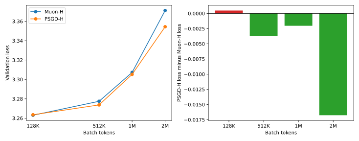

# PSGD final experiment report

This report records the completed PSGD experiments in Track 3 and in the
frozen nanochat d8 ladder. Track 3 uses PSGD-H because its matrices have
nonzero random initialization. Nanochat uses PSGD-W because its output
projections are initialized to zero and must receive additive updates.

## Baseline reproduction

The unmodified recipe from modded-nanogpt PR #316 was run for 3,400 steps on
five H20 seeds. Its mean validation loss was 3.276080. The corresponding
published H100 mean was 3.276660, so the H20 reproduction was better by
0.000580 and passed the 0.003 parity tolerance. The seed-level observations
are in the [baseline report](../psgdh_pr316_baseline/pretraining_psgdh_pr316_baseline_r1_20260828_0740/BASELINE_REPORT.md).

## Track 3 batch-size coordinate descent

Every coordinate-descent round evaluates 32 cases around one common center.
All cases use seed 1, the same fixed token horizon, and H20 GPUs. A coordinate
movement is accepted only if it improves validation loss by at least 0.003.
The next center is always a recipe that was directly observed, rather than an
unevaluated combination of independent coordinate winners.

The loss difference below is PSGD-H loss minus Muon-H loss, so a negative
number favors PSGD-H.

| Batch | PSGD-H loss | Muon-H loss | Difference | CD rounds |
|---:|---:|---:|---:|---:|
| 128K | 3.26353 | 3.26305 | +0.00048 | 3 |
| 512K | 3.27370 | 3.27745 | -0.00375 | 9 |
| 1M | 3.30521 | 3.30724 | -0.00203 | 2 |
| 2M | 3.35438 | 3.37114 | -0.01676 | 8 |

The complete comparison data are in
[`final_reports/track3_batch_comparison.csv`](final_reports/track3_batch_comparison.csv).
These are single-seed optimizer outcomes and are not multi-seed significance
claims.

The final entries below multiply the corresponding PR #316 reference value.
For a beta entry, the multiplier is applied to one minus beta before beta is
reconstructed. Cooldown entries are absolute fractions of the training
horizon.

| Batch | Matrix LR | Preconditioner LR | Matrix first moment | Auxiliary LR | Auxiliary first moment | Auxiliary second moment | Auxiliary cooldown | Matrix cooldown |
|---:|---:|---:|---:|---:|---:|---:|---:|---:|
| 128K | 0.5 | 1 | 2 | 2 | 2 | 0.5 | 0.5 | 1 |
| 512K | 1 | 1 | 2 | 1.41421356237 | 1 | 0.5 | 0.5 | 1 |
| 1M | 1 | 1 | 1 | 1 | 1 | 1 | 0.5 | 1 |
| 2M | 1.41421356237 | 1.41421356237 | 1.41421356237 | 1.41421356237 | 1 | 0.5 | 0.5 | 0.8 |

The per-case raw observations, round decisions, recipes, and plots are in the
[128K](final_reports/128k/REPORT.md),
[512K](final_reports/512k/REPORT.md),
[1M](final_reports/1m/REPORT.md), and
[2M](final_reports/2m/REPORT.md) report directories.

## Nanochat d8 PSGD-W ladder

The nanochat model is frozen at upstream commit
`ccf4b7f9bf91a250aa398a0cecab270bcea56050`. It has depth 8, width 512,
sequence length 2,048, and 58,720,256 scaling parameters. Every case uses seed
1, the same FineWeb-Edu split, and eight H20 GPUs.

At the 262,144-token batch and eight tokens per parameter, coordinate descent
selected matrix learning rate 0.0006, matrix weight decay 0.1, matrix first
moment beta 0.9, preconditioner learning rate 0.4, preconditioner initial scale
1.0, update RMS clip 1.1, auxiliary learning-rate multiplier 1.0, auxiliary
betas 0.8 and 0.95, and warmdown fraction 0.4.

The data-horizon curve at batch 262,144 is:

| Tokens per parameter | Validation BPB |
|---:|---:|
| 1 | 1.39863610 |
| 2 | 1.20812746 |
| 4 | 1.12867578 |
| 8 | 1.07692115 |
| 12 | 1.05482195 |
| 16 | 1.04247026 |
| 24 | 1.02570862 |

The batch ladder fixes the horizon at eight tokens per parameter and uses the
best rule from the earlier 216-rule transfer sweep. Matrix and auxiliary
learning rates and first moments remain fixed. Matrix weight decay scales
linearly with batch size. The auxiliary second moment preserves its EMA
timescale.

| Batch tokens | PSGD-W BPB | PSGD-W CE penalty | Muon-W CE penalty |
|---:|---:|---:|---:|
| 262,144 | 1.07692115 | 0.000000 | 0.000000 |
| 524,288 | 1.09191691 | 0.286240 | 0.215134 |
| 1,048,576 | 1.12725950 | 0.523313 | 0.465283 |
| 2,097,152 | 1.23233527 | 0.767814 | 0.714092 |

At the anchor, Muon-W reaches 1.07112310 BPB, which is 0.00579805 better than
PSGD-W. PSGD-W also has a larger measured CE penalty at every tested batch
above 262K, so there is no measured crossover. The raw ladder, fitted curve,
CE tables, and three plots are stored in wuji under
`projects/nanochat-data-scaling/results/psgdw-20260828` at commit `b743117`.

## Conclusions

The PR #316 PSGD implementation reproduces on H20 within the stated parity
tolerance. In Track 3, the loss difference is small at 128K and 1M, while
PSGD-H is better at 512K and especially at 2M in these single-seed runs. In the
frozen nanochat d8 setting, PSGD-W is worse than Muon-W both at the anchor and
in large-batch compute efficiency.
